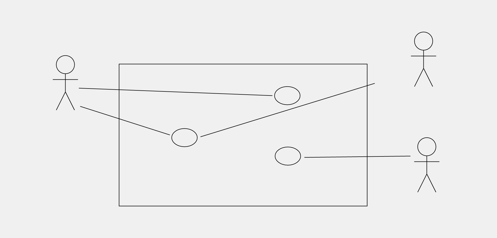

# Jesture
Jesture - an experimental context diagram tool

("You see, there's an inside and an outside and there's a boundary. That's it! Boundaries, people!")

[Status: Paused]

Uses gestures to draw the diagram.

